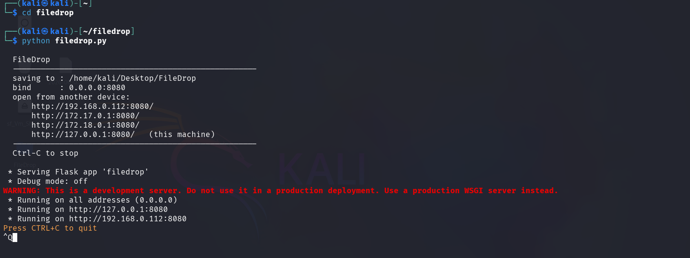
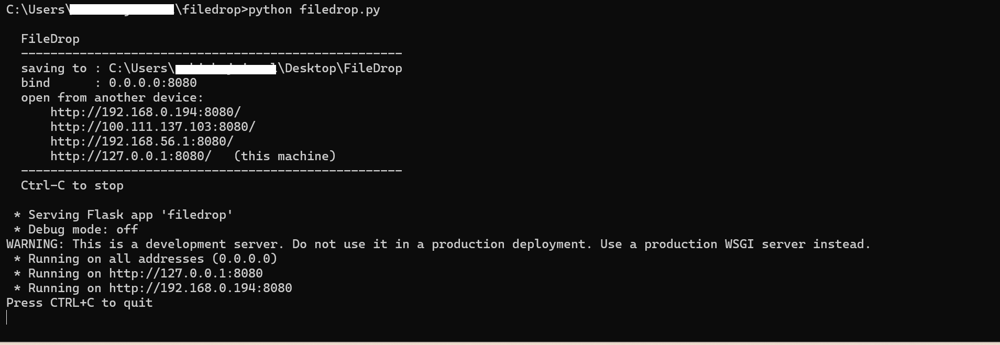
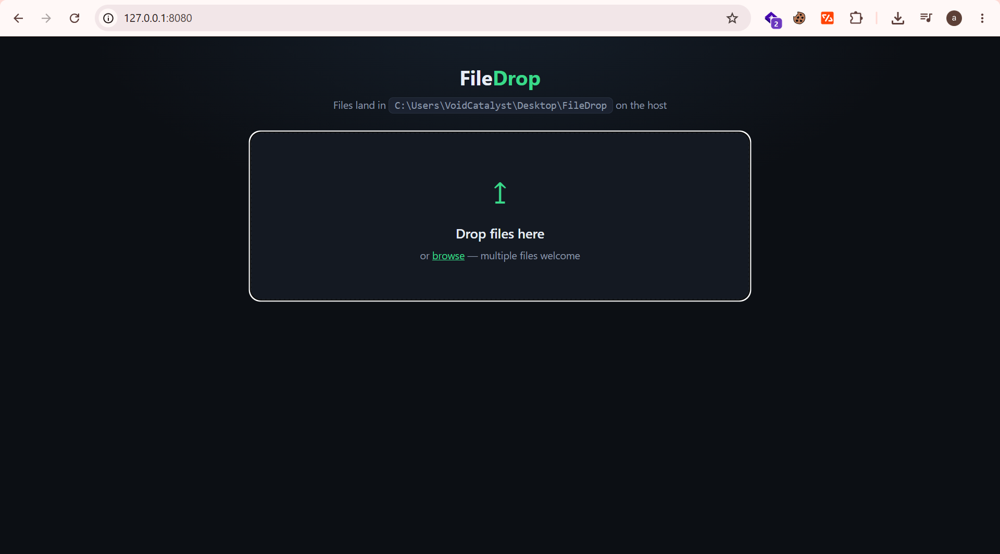

# FileDrop

> Lightweight LAN file receiver — send files from **any device** on your network to your PC via browser. No apps, no accounts, no cables.


---

## Screenshots

**Kali Linux — terminal output**


**Windows — terminal output**


**Browser UI**


---

## How It Works

1. Run `filedrop.py` on your PC
2. It prints a local IP address and port
3. Open that URL on **any device** on the same network (phone, tablet, another laptop)
4. Drag & drop or browse files — they land instantly in a folder on your PC

Works over **Wi-Fi**, **LAN cable**, or any local network connection.

---

## Features

- Drag-and-drop or click-to-browse upload
- Multiple files at once with individual progress bars
- Works from any browser — no app install on the sending device
- Cross-platform: **Windows**, **Linux** (Kali, Ubuntu, etc.), **macOS**
- Auto-detects all network interfaces (Wi-Fi, LAN, VPN, Docker)
- Custom save directory and port via CLI flags
- Minimal dependencies — just Python + Flask

---

## Requirements

- Python 3.7 or higher
- Flask

```bash
pip install flask
```

---

## Installation

```bash
# Clone the repository
git clone https://github.com/VoidCatalyst/filedrop.git
cd filedrop

# Install dependency
pip install flask
```

---

## Usage

### Basic (saves to `~/Desktop/FileDrop`)

```bash
python filedrop.py
```

### Custom save directory

```bash
python filedrop.py -d /path/to/folder
```

### Custom port (default: 8080)

```bash
python filedrop.py -p 9090
```

### All options

```bash
python filedrop.py -d /path/to/folder -p 9090
```

---

## Output Example

```
  FileDrop
  ----------------------------------------------------
  saving to : /home/kali/Desktop/FileDrop
  bind      : 0.0.0.0:8080
  open from another device:
      http://192.168.0.112:8080/
      http://127.0.0.1:8080/   (this machine)
  ----------------------------------------------------
  Ctrl-C to stop
```

Open the printed URL on any device on the same network and start uploading.

---

## Use Cases

| Scenario | How |
|---|---|
| Phone → PC over Wi-Fi | Run on PC, open IP in phone browser |
| Laptop A → Laptop B via LAN cable | Set static IPs, run on receiver, open in sender browser |
| Any device → Kali Linux (pentesting lab) | Run on Kali, receive files from any device |
| Office file sharing (no USB) | Run on PC, share IP with colleagues |

---

## LAN Cable (Direct Connection — No Internet or Wi-Fi Needed)

You can transfer files between two devices using **only an Ethernet cable** — no router, no internet, no Wi-Fi required.

### How it works
- Connect the two devices with an Ethernet cable
- Manually assign static IPs on both devices so they can talk to each other
- Run FileDrop on the receiving device
- Open the receiver's IP in a browser on the sending device and upload

---

### Step 1 — Check the IP on the sending device (the one with the files)

**Windows:**
```
Win + R → type: cmd → press Enter
ipconfig
```
Note the **IPv4 Address** and **Subnet Mask** under the Ethernet adapter.

**Kali / Linux:**
```bash
ip addr show
# or
ifconfig
```
Note the `inet` address on your Ethernet interface (e.g. `eth0`, `enp3s0`).

---

### Step 2 — Set a static IP on the receiving device (the one that will run FileDrop)

Pick any IP in the **same subnet** with a **different last number** than the sender.

> Example: sender is `192.168.1.20` → set receiver to `192.168.1.10`

**Windows:**
1. `Win + R` → `ncpa.cpl` → Enter
2. Right-click your **Ethernet** adapter → **Properties**
3. Select **Internet Protocol Version 4 (TCP/IPv4)** → **Properties**
4. Choose **Use the following IP address** and fill in:
   ```
   IP Address  : 192.168.1.10
   Subnet Mask : 255.255.255.0
   Gateway     : (leave blank)
   ```
5. Click **OK**

**Kali / Linux:**
```bash
# Replace eth0 with your actual interface name
sudo ip addr add 192.168.1.10/24 dev eth0
sudo ip link set eth0 up
```

Also set a static IP on the **sender** the same way (e.g. `192.168.1.20`).

---

### Step 3 — Verify the cable connection

From the receiving device, ping the sender:
```bash
ping 192.168.1.20
```
If you get replies → cable is working and both devices can see each other.

---

### Step 4 — Run FileDrop on the receiving device

```bash
python filedrop.py
```

Output will show:
```
  open from another device:
      http://192.168.1.10:8080/
```

---

### Step 5 — Open that URL on the sending device's browser

Go to `http://192.168.1.10:8080/` → drag & drop or browse files → they land on the receiver instantly.

> **Tip:** This works even in places with no internet — exam halls, labs, field work, flights, etc.

---

## CLI Reference

| Flag | Default | Description |
|---|---|---|
| `-d`, `--dir` | `~/Desktop/FileDrop` | Directory to save uploaded files |
| `-p`, `--port` | `8080` | Port to listen on |
| `-H`, `--host` | `0.0.0.0` | Host to bind (0.0.0.0 = all interfaces) |

---

## License

MIT — free to use, modify and distribute.
